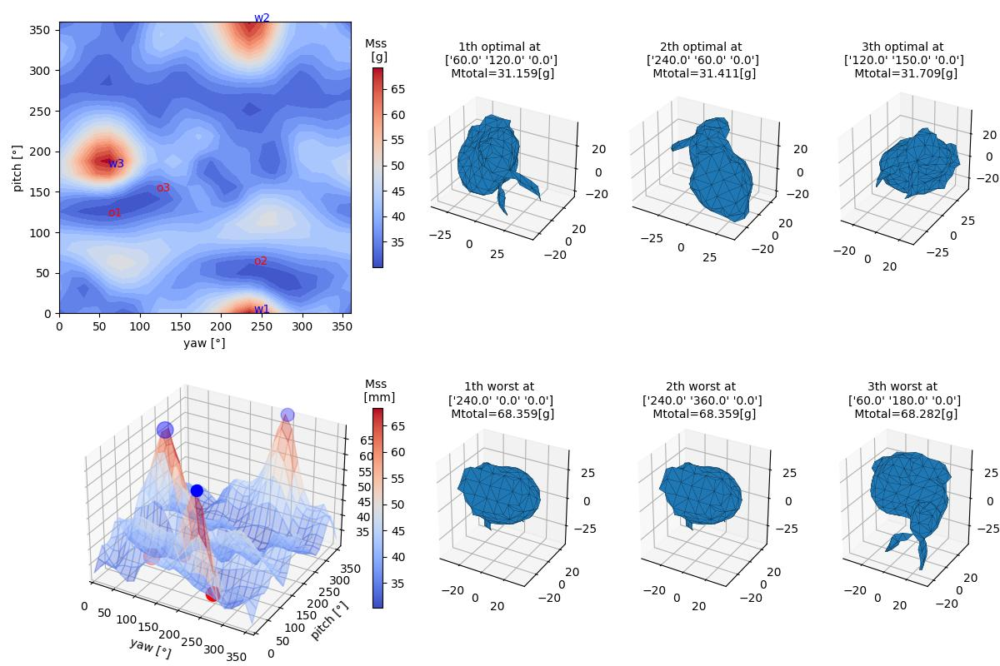
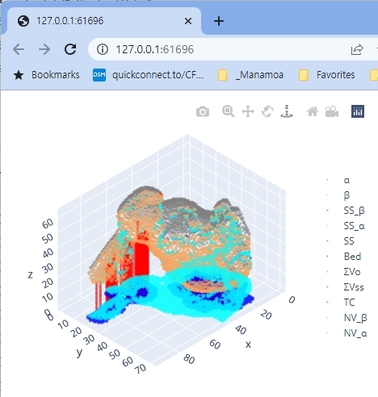

# tomo_GPGPU2024
modified support structure tomography, General-Purpose GPU calculation version (2024)

#### 1. Download and upzip all the files of this repository to your PC ("Code"->"Download Zip")

#### 2. Install software
#####    (1) Install Visual Studio Code (VSCode)
#####    (2) Install Python 3 (preferably Version 3.10.5 64bit)
#####    (3) Install Python packages using "requirements.txt".
```
pip install -r requirements.txt
```
#####    (4) Install VC++ 2015, 2017, 2019, and 2022 Redistributable package
( https://learn.microsoft.com/en-us/cpp/windows/latest-supported-vc-redist?view=msvc-170 ).

#####    (5) (Optional) If you want to modify CPU/GPU code in VS, Install NVIDIA CUDA package (v12.0 or above)
( https://developer.nvidia.com/cuda-12-1-0-download-archive )

#### 3. Open the downloaded folder in VSCode (Main menu->"File"->"Open Folder"). 

#### 4. Modify  mesh filename,  initial orientation and angle interval(=theta_YP) in "tomo_GPU2024.py" under "\python_src\".  Run the "tomo_GPU2024.py" (shortcut key, F5)

#####    (1) To search optimal orientation, input "theta_yp" value as "360 / N " (where N = integer).
```
#=========================================================================================
DataSet= [ ('.\\Tomo_MeshData\\(5)Bunny_69k.ply',  0,  0, 0)]
theta_YP = 5
#=========================================================================================
```


#####    (2) To see the support structure information for the given (yaw, pitch, roll), set "theta_YP" as zero.
```
#=========================================================================================
DataSet= [ ('.\\Tomo_MeshData\\(5)Bunny_69k.ply',  231, 54, 0) #1st optimal of Bunny
theta_YP = 0
#=========================================================================================
```


#####    (3) Select bed structure 
```
#=========================================================================================
# tomoNV_Cpp1.BedType = ( enumBedType.ebtNone, 0, 0, 0)
# tomoNV_Cpp1.BedType = ( enumBedType.ebtSkirt, 3, 3+0.8, 0.2)
# tomoNV_Cpp1.BedType = ( enumBedType.ebtBrim, 0, 10 * 0.4, 0.2)
tomoNV_Cpp1.BedType = ( enumBedType.ebtRaft, 0, 2, 0.3 + 0.27 + 2 * 0.2)
#=========================================================================================
```

#####    (4) Run using either CPU or GPU 
```
#=========================================================================================
#tomoNV_Cpp1.Run(cpp_function_name = 'TomoNV_INT3') #call CPU version
tomoNV_Cpp1.Run(cpp_function_name = 'TomoNV_CUDA') #call GPU version. Need NVIDIA graphic card (GTX1050 or above)
#=========================================================================================
```

